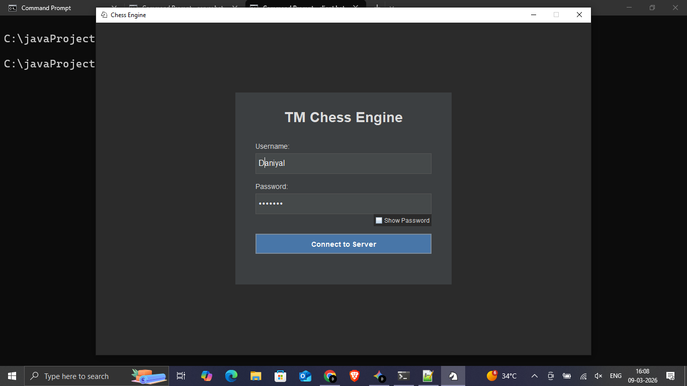
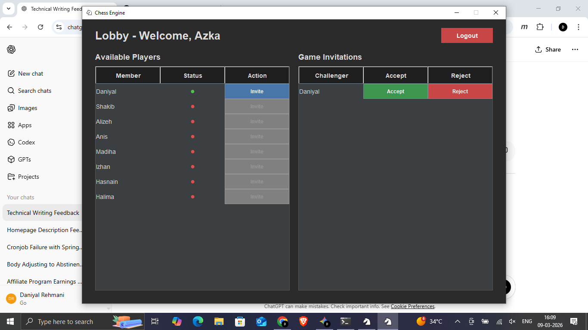
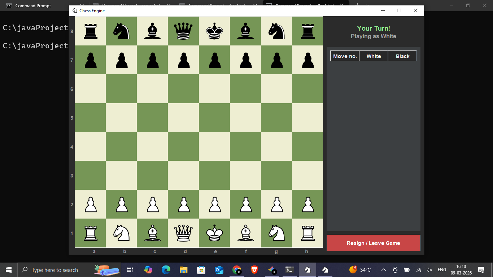
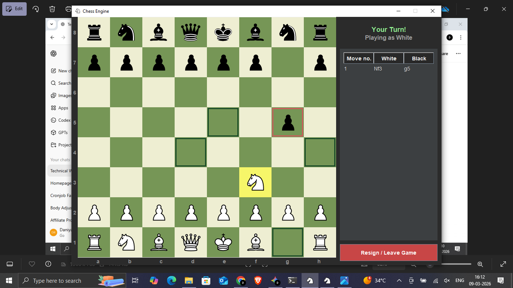
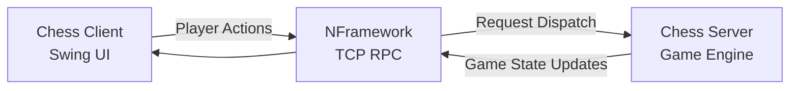

# Multiplayer Chess

A real-time multiplayer chess system built in **Java** using a custom **TCP networking framework** and a **server-authoritative architecture**.

The server manages game sessions and validates all chess rules, while the desktop client renders the UI using **Java Swing**. The project demonstrates low-level networking, concurrent session management, and real-time game synchronization without relying on web frameworks.

---

## Demo

*(Add a short demo video here once i recorded)*

---

## Screenshots

### Login



### Lobby Dashboard



### Chess Board



### Gameplay



---

## Features

* Real-time multiplayer gameplay over **TCP sockets**
* **Server-authoritative chess engine** (all rules validated server-side)
* Player lobby with invitation system
* Move history tracking
* Highlighted valid moves and captures
* Dark-themed Swing user interface
* Custom RPC-style networking framework

---

## Architecture

The application follows a **multi-tier client–server architecture**.



### Responsibilities

**Client**

* User interface
* Rendering board state
* Sending player actions

**Server**

* Game rule validation
* Session management
* Player status tracking
* Move synchronization

Communication between client and server is handled through a **custom TCP networking framework**.

---

## Networking Layer

The project uses a custom networking framework called **NFramework**.

NFramework provides:

* TCP connection management
* request routing
* serialization
* asynchronous request handling

Repository:
[https://github.com/mohammeddaniyal/nframework](https://github.com/mohammeddaniyal/nframework)

This framework allows the client to invoke server-side handlers in an **RPC-style manner** rather than using REST APIs.

---

## Project Structure

```
multiplayer-chess
 ├── ChessClient
 │     Swing-based desktop application
 │
 ├── ChessServer
 │     Multiplayer game engine and session manager
 │
 ├── ChessCommon
 │     Shared DTOs and network message contracts
 │
 └── screenshots
       UI screenshots used in documentation
```

---

## Requirements

Java **21**

---

## Configuration

The application supports optional configuration using `server.properties`.

### Client configuration

Create a file named:

```
server.properties
```

inside the `ChessClient` directory.

Example:

```
HOST=127.0.0.1
PORT=5500
```

---

### Server configuration

Create `server.properties` inside the `ChessServer` directory:

```
PORT=5500
```

If the configuration file is not present, default values will be used.

---

## Running the Application

### Start the Server

```
java -jar chess-server.jar
```

---

### Start the Client

```
java -jar chess-client.jar
```

Run **two client instances** to simulate multiplayer gameplay.

---

## Download

Pre-built binaries are available in the **Releases** section.

Assets include:

* `chess-server.jar`
* `chess-client.jar`

---

## Technologies Used

* Java
* Java Swing
* TCP sockets
* Gradle
* JSON (GSON)

---

## Future Improvements

Potential enhancements:

* Spectator mode
* Match history persistence
* Ranking system
* Web-based client

---

## Author

Mohammed Daniyal

---
